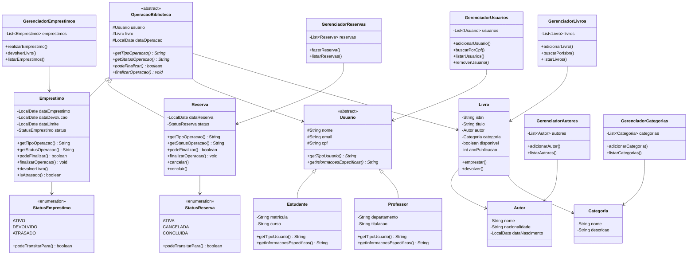

# Diagrama de Classes UML

## Sistema de Gestão de Biblioteca Digital

## Legenda

- **Herança 1:** `Usuario` é classe abstrata base para `Estudante` e `Professor`
- **Herança 2:** `OperacaoBiblioteca` é classe abstrata base para `Emprestimo` e `Reserva`
- **Polimorfismo 1:** `getTipoUsuario()` e `getInformacoesEspecificas()` em `Estudante` e `Professor`
- **Polimorfismo 2:** `getTipoOperacao()`, `getStatusOperacao()`, `podeFinalizar()` e `finalizarOperacao()` em `Emprestimo` e `Reserva`
- **Composição:** `Livro` contém `Autor` e `Categoria`
- **Associação:** `OperacaoBiblioteca` (e suas subclasses) associam `Usuario` e `Livro`
- **Enum:** `StatusEmprestimo` e `StatusReserva` definem estados
- **Controller:** Gerenciadores implementam operações CRUD

