# Diagrama de Classes UML

## Sistema de Gestão de Biblioteca Digital

```mermaid
classDiagram
    class Usuario {
        <<abstract>>
        #String nome
        #String email
        #String cpf
        +getTipoUsuario()* String
        +getInformacoesEspecificas()* String
        +getNome()
        +setNome()
        +getEmail()
        +setEmail()
        +getCpf()
    }
    
    class Estudante {
        -String matricula
        -String curso
        +getTipoUsuario() String
        +getInformacoesEspecificas() String
        +getMatricula()
        +setMatricula()
        +getCurso()
        +setCurso()
    }
    
    class Professor {
        -String departamento
        -String titulacao
        +getTipoUsuario() String
        +getInformacoesEspecificas() String
        +getDepartamento()
        +setDepartamento()
        +getTitulacao()
        +setTitulacao()
    }
    
    class Livro {
        -String isbn
        -String titulo
        -Autor autor
        -Categoria categoria
        -boolean disponivel
        -int anoPublicacao
        +getIsbn()
        +getTitulo()
        +setTitulo()
        +getAutor()
        +setAutor()
        +getCategoria()
        +setCategoria()
        +isDisponivel()
        +getAnoPublicacao()
        +setAnoPublicacao()
        +emprestar()
        +devolver()
    }
    
    class Autor {
        -String nome
        -String nacionalidade
        -LocalDate dataNascimento
        +getNome()
        +setNome()
        +getNacionalidade()
        +setNacionalidade()
        +getDataNascimento()
        +getDataNascimentoFormatada()
        +setDataNascimento()
    }
    
    class Categoria {
        -String nome
        -String descricao
        +getNome()
        +setNome()
        +getDescricao()
        +setDescricao()
    }
    
    class OperacaoBiblioteca {
        <<abstract>>
        #Usuario usuario
        #Livro livro
        #LocalDate dataOperacao
        +getTipoOperacao()* String
        +getStatusOperacao()* String
        +podeFinalizar()* boolean
        +finalizarOperacao()* void
        +getUsuario()
        +setUsuario()
        +getLivro()
        +setLivro()
        +getDataOperacao()
        +setDataOperacao()
        +getDataOperacaoFormatada()
    }
    
    class Emprestimo {
        -LocalDate dataEmprestimo
        -LocalDate dataDevolucao
        -LocalDate dataLimite
        -StatusEmprestimo status
        +getTipoOperacao() String
        +getStatusOperacao() String
        +podeFinalizar() boolean
        +finalizarOperacao() void
        +getDataEmprestimo()
        +getDataEmprestimoFormatada()
        +setDataEmprestimo()
        +getDataDevolucao()
        +getDataDevolucaoFormatada()
        +setDataDevolucao()
        +getDataLimite()
        +getDataLimiteFormatada()
        +setDataLimite()
        +getStatus()
        +setStatus()
        +devolverLivro()
        +isAtrasado() boolean
        +atualizarStatus() void
    }
    
    class Reserva {
        -LocalDate dataReserva
        -StatusReserva status
        +getTipoOperacao() String
        +getStatusOperacao() String
        +podeFinalizar() boolean
        +finalizarOperacao() void
        +getDataReserva()
        +getDataReservaFormatada()
        +setDataReserva()
        +getStatus()
        +setStatus()
        +cancelar()
        +concluir()
        +isAtiva() boolean
    }
    
    class StatusEmprestimo {
        <<enumeration>>
        ATIVO
        DEVOLVIDO
        ATRASADO
        +podeTransitarPara() boolean
        +getDescricao() String
    }
    
    class StatusReserva {
        <<enumeration>>
        ATIVA
        CANCELADA
        CONCLUIDA
        +podeTransitarPara() boolean
        +getDescricao() String
    }
    
    class GerenciadorUsuarios {
        -List~Usuario~ usuarios
        +adicionarUsuario()
        +buscarPorCpf()
        +buscarPorNome()
        +listarUsuarios()
        +listarEstudantes()
        +listarProfessores()
        +atualizarUsuario()
        +removerUsuario()
        +temUsuarios()
        +getQuantidadeUsuarios()
        +getQuantidadeEstudantes()
        +getQuantidadeProfessores()
    }
    
    class GerenciadorLivros {
        -List~Livro~ livros
        +adicionarLivro()
        +buscarPorIsbn()
        +buscarPorTitulo()
        +buscarPorAutor()
        +buscarPorCategoria()
        +listarLivros()
        +listarLivrosDisponiveis()
        +listarLivrosIndisponiveis()
        +atualizarLivro()
        +removerLivro()
        +temLivros()
        +getQuantidadeLivros()
        +getQuantidadeLivrosDisponiveis()
        +getQuantidadeLivrosIndisponiveis()
    }
    
    class GerenciadorEmprestimos {
        -List~Emprestimo~ emprestimos
        +realizarEmprestimo()
        +buscarPorUsuario()
        +buscarPorLivro()
        +listarEmprestimos()
        +listarEmprestimosAtivos()
        +devolverLivro()
        +removerEmprestimo()
        +getQuantidadeEmprestimos()
    }
    
    class GerenciadorReservas {
        -List~Reserva~ reservas
        +fazerReserva()
        +buscarPorUsuario()
        +buscarPorLivro()
        +listarReservas()
        +listarReservasAtivas()
        +atualizarStatus()
        +removerReserva()
        +getQuantidadeReservas()
    }
    
    class GerenciadorAutores {
        -List~Autor~ autores
        +adicionarAutor()
        +buscarPorNome()
        +listarAutores()
        +atualizarAutor()
        +removerAutor()
        +getQuantidadeAutores()
    }
    
    class GerenciadorCategorias {
        -List~Categoria~ categorias
        +adicionarCategoria()
        +buscarPorNome()
        +listarCategorias()
        +atualizarCategoria()
        +removerCategoria()
        +getQuantidadeCategorias()
    }
    
    class Editora {
        -String nome
        -String cnpj
        -String endereco
        -String telefone
        +getNome()
        +setNome()
        +getCnpj()
        +getCnpjFormatado()
        +getEndereco()
        +setEndereco()
        +getTelefone()
        +setTelefone()
    }
    
    class Avaliacao {
        -Usuario usuario
        -Livro livro
        -int nota
        -String comentario
        -LocalDate dataAvaliacao
        +getUsuario()
        +setUsuario()
        +getLivro()
        +setLivro()
        +getNota()
        +setNota()
        +getComentario()
        +setComentario()
        +getDataAvaliacao()
        +getDataAvaliacaoFormatada()
        +getNotaEstrelas()
    }
    
    class PreferenciasUsuario {
        -String nomeExibicao
        -TemaInterface tema
        +getNomeExibicao()
        +setNomeExibicao()
        +getTema()
        +setTema()
        +alternarTema()
    }
    
    class GerenciadorEditoras {
        -List~Editora~ editoras
        +adicionarEditora()
        +buscarPorCnpj()
        +buscarPorNome()
        +listarEditoras()
        +atualizarEditora()
        +removerEditora()
        +buscar()
        +listarTodos()
        +existe()
        +contarTotal()
        +gerarRelatorio()
        +gerarEstatisticas()
        +exportarDados()
    }
    
    class GerenciadorAvaliacoes {
        -List~Avaliacao~ avaliacoes
        +adicionarAvaliacao()
        +buscarPorUsuario()
        +buscarPorLivro()
        +buscarPorNota()
        +listarAvaliacoes()
        +atualizarAvaliacao()
        +removerAvaliacao()
        +calcularMediaLivro()
        +buscar()
        +listarTodos()
        +existe()
        +contarTotal()
        +gerarRelatorio()
        +gerarEstatisticas()
        +exportarDados()
    }
    
    class GerenciadorPreferencias {
        -PreferenciasUsuario preferencias
        +carregarPreferencias()
        +salvarPreferencias()
        +getPreferencias()
        +atualizarNomeExibicao()
        +atualizarTema()
        +alternarTema()
        +resetarPreferencias()
        +exibirPreferencias()
    }
    
    class TemaInterface {
        <<enumeration>>
        CLARO
        ESCURO
        +getNome()
        +getCodigoCor()
        +getCorTexto()
        +aplicarTema()
        +alternar()
        +fromString()
    }
    
    class Pesquisavel {
        <<interface>>
        +buscar()* List
        +listarTodos()* List
        +existe()* boolean
        +contarTotal()* int
    }
    
    class Relatorivel {
        <<interface>>
        +gerarRelatorio()* String
        +gerarEstatisticas()* String
        +exportarDados()* String
    }
    
    Usuario <|-- Estudante
    Usuario <|-- Professor
    OperacaoBiblioteca <|-- Emprestimo
    OperacaoBiblioteca <|-- Reserva
    Livro --> Autor
    Livro --> Categoria
    OperacaoBiblioteca --> Usuario
    OperacaoBiblioteca --> Livro
    Emprestimo --> StatusEmprestimo
    Reserva --> StatusReserva
    Avaliacao --> Usuario
    Avaliacao --> Livro
    PreferenciasUsuario --> TemaInterface
    GerenciadorUsuarios --> Usuario
    GerenciadorLivros --> Livro
    GerenciadorEmprestimos --> Emprestimo
    GerenciadorReservas --> Reserva
    GerenciadorAutores --> Autor
    GerenciadorCategorias --> Categoria
    GerenciadorEditoras --> Editora
    GerenciadorAvaliacoes --> Avaliacao
    GerenciadorPreferencias --> PreferenciasUsuario
    GerenciadorEditoras ..|> Pesquisavel
    GerenciadorEditoras ..|> Relatorivel
    GerenciadorAvaliacoes ..|> Pesquisavel
    GerenciadorAvaliacoes ..|> Relatorivel
```

## Legenda

- **Herança 1:** `Usuario` é classe abstrata base para `Estudante` e `Professor`
- **Herança 2:** `OperacaoBiblioteca` é classe abstrata base para `Emprestimo` e `Reserva`
- **Polimorfismo 1:** `getTipoUsuario()` e `getInformacoesEspecificas()` em `Estudante` e `Professor`
- **Polimorfismo 2:** `getTipoOperacao()`, `getStatusOperacao()`, `podeFinalizar()` e `finalizarOperacao()` em `Emprestimo` e `Reserva`
- **Composição:** `Livro` contém `Autor` e `Categoria`
- **Associação:** `OperacaoBiblioteca` (e suas subclasses) associam `Usuario` e `Livro`
- **Associação:** `Avaliacao` associa `Usuario` e `Livro`
- **Associação:** `PreferenciasUsuario` associa `TemaInterface`
- **Enum:** `StatusEmprestimo`, `StatusReserva` e `TemaInterface` definem estados/valores
- **Interface:** `Pesquisavel` e `Relatorivel` definem contratos para funcionalidades de busca e relatórios
- **Implementação:** `GerenciadorEditoras` e `GerenciadorAvaliacoes` implementam `Pesquisavel` e `Relatorivel`
- **Controller:** Gerenciadores implementam operações CRUD e gerenciamento de entidades

